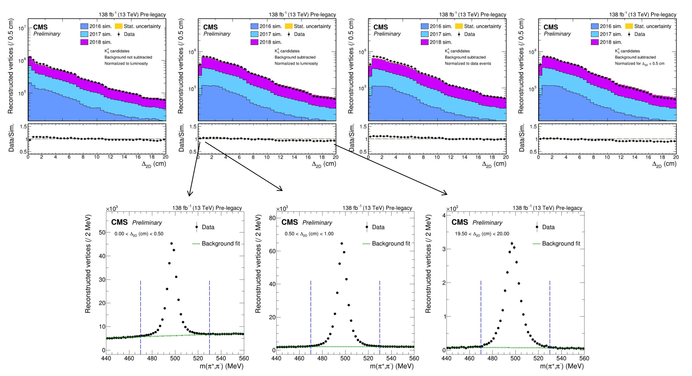

# Analysis code for displaced vertexing study with K-short mesons

### Introduction
This is the analysis code that is at the basis of the study presented in [AN-20-111](https://icms.cern.ch/tools/publications/notes/entries/AN/2020/111) (CMS internal) and [DP-2024-010](https://cds.cern.ch/record/2890104) (public). An introduction to the topic and the methodology are given in both references.

### Prerequisites
This code requires a specific input file format.
It runs on ROOT ntuples (i.e. flat trees with variable-length arrays as branches) that have been produced from MiniAOD with a custom ntuplizer.
Apart from standard lepton and jet analyzers, a custom analyzer for V0 reconstruction was added in the ntuplizer.
The V0 analyzer has been added for reference in this repository (see the `ntuplizer` directory), but it will need to be somehow fitted into any ntuplizing framework of your choice, in case you want to run it.

### Workflow
Starting from the ntuples produced by the ntuplizer (usually with CRAB),
the following steps should be performed:
- skimming: select clean Z to mu+ mu- events, see the `skimming` folder.
- v0building: select V0 candidates and calculate their properties, see the `v0building` folder.
- analysis: compare V0 properties between data and simulation, see the `analysis` folder.

### Main results
The main results are of the form summarized in this figure:

Distributions of the number of reconstructed K mesons as a function of radial displacement are compared between data and simulation. Special care is taken with the normalization and background subtraction from sidebands in the invariant mass spectrum. For more details, see the AN and DP linked above.
